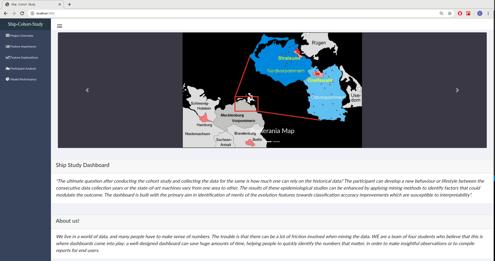
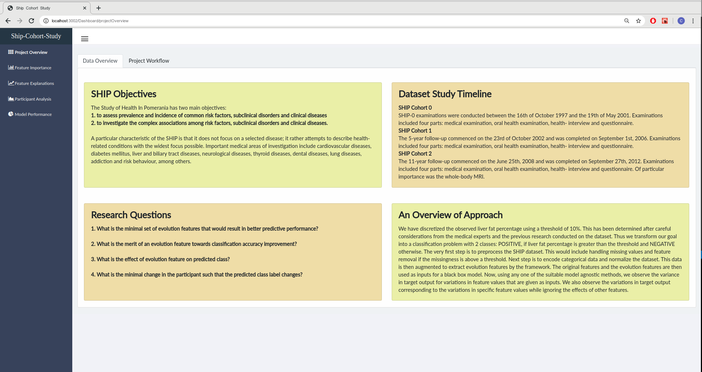
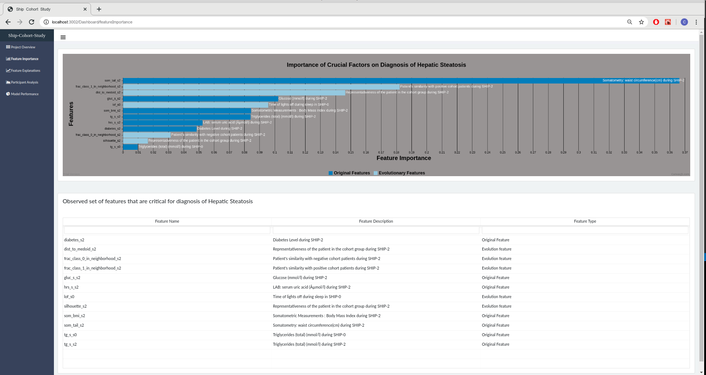
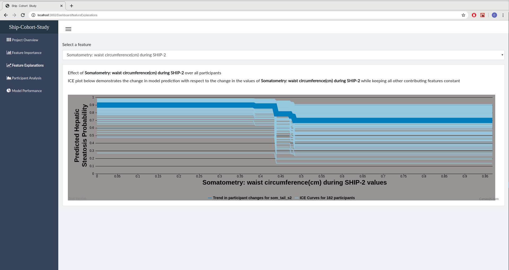
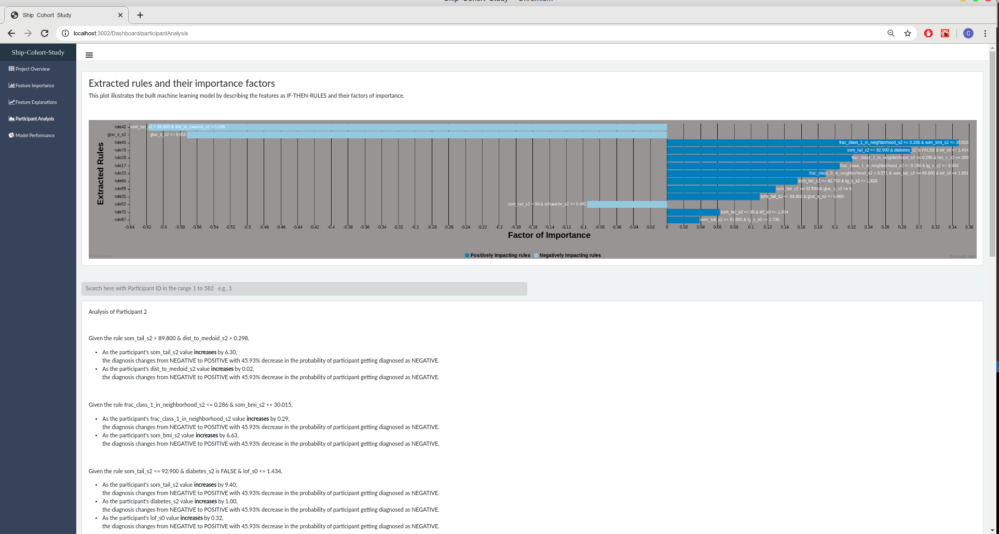
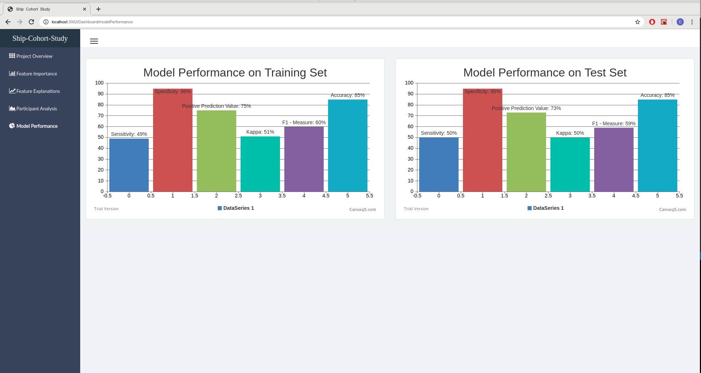

# Ship Study UI

## Overview

A reactjs frontend dashboard that visualizes the model results of **SHIP Cohort Study**. The application has 5 views:

- Home Page: Introduction to the project and our problem statement



- Project Overview: Displays the overview of the research goals of the project



- Feature Importance: Displays features critical in diagnosis of Hepatic Steatosis



- Feature Explanations: Displays ICE and PDP curves for selected feature



- Participant Analysis: Displays the minimal change in the participant so that the predicted diagnosis changes



- Model Performance: Displays the model performance results evaluated against training set and test set



## Installation and Launching the application

### Requirements:

- node version > 10.0 installed
- npm version > 3.0 installed

### Run

- Navigate to the project directory (where package.json is located) and run
  ```cmd
  npm install
  npm start
  ```
- Suggestion: Run this with sudo(linux) and as administrator in windows so that the changes reflect at real time.
- After running the above command, the application will be available at http://localhost:3002

## Structure

- src/front contains all ui code
- src/front/container will contain dashboard header, sidebar, footer are present
- src/front/components will contain individual components like buttons, tables and such ui components
